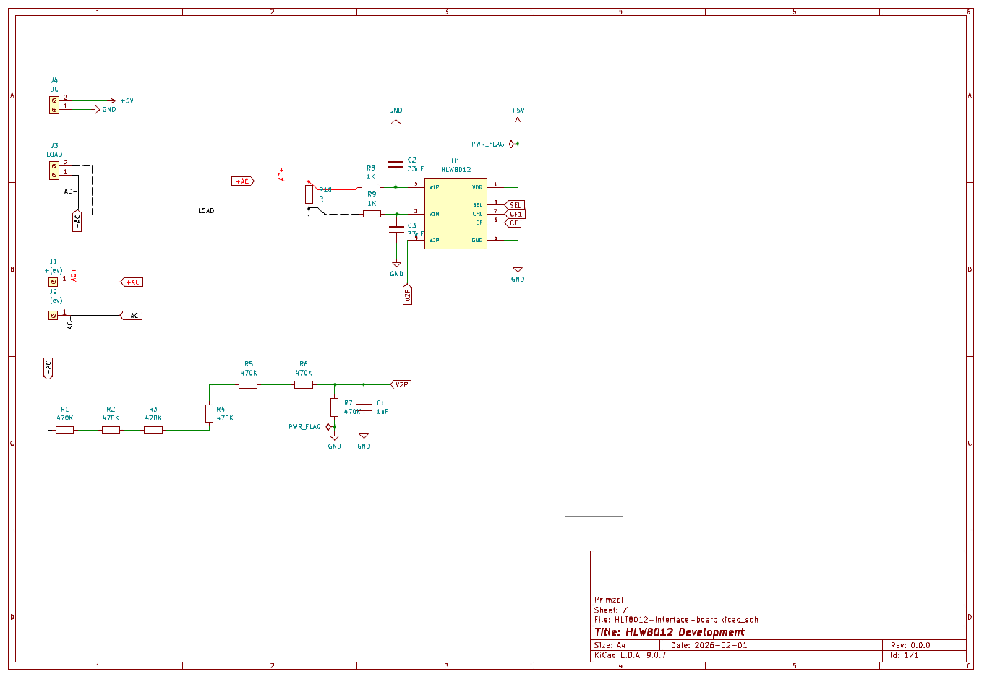
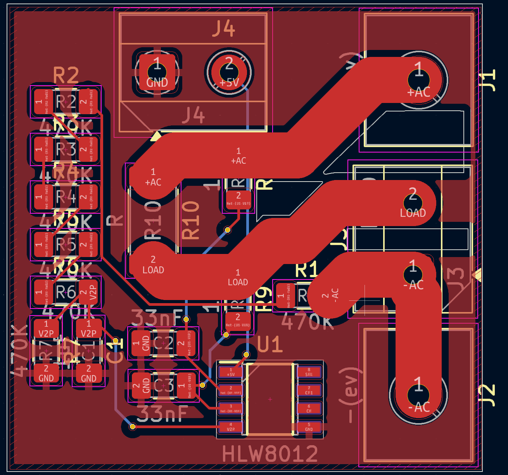

# HLT8012-Interface-board

This is a KiCad project for a basic interface board using the HLW8012 energy metering IC. The board is designed to power up the HLW8012, interface with a load, and expose the output pins for easy connection to an external microcontroller (MCU). Note that this board does **not** include an onboard MCU; it is intended as a breakout/interface board for the HLW8012 only.

## Features
- Simple interface board for HLW8012
- Provides power and load connections
- Exposes HLW8012 output pins for MCU interfacing
- No onboard microcontroller

## Screenshots

### Schematic

### PCB Layout

## HLW8012 Datasheet

[Click here to view the HLW8012 Datasheet (PDF)](./HLW8012.pdf)

<!-- Optionally, add a screenshot of the datasheet's first page for visual context:

-->

## Usage
1. Use the provided schematic and PCB files in KiCad to review or modify the design.
2. Manufacture the board using the Gerber files in the `exports/` directory.
3. Solder the HLW8012 and other components as per the schematic.
4. Connect your load and power supply.
5. Interface the output pins with your own MCU for energy measurement applications.

## References
- [HLW8012 Datasheet](./HLW8012.pdf)

---

*This project is intended for prototyping and educational purposes. Please verify the design and safety aspects before use in production environments.*
